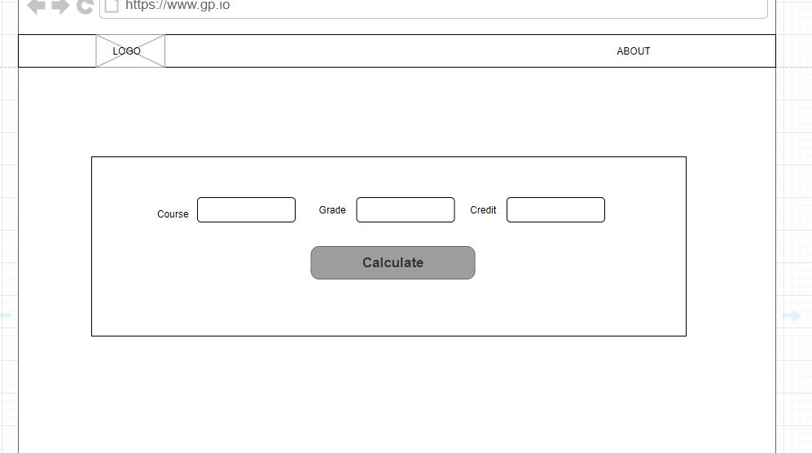
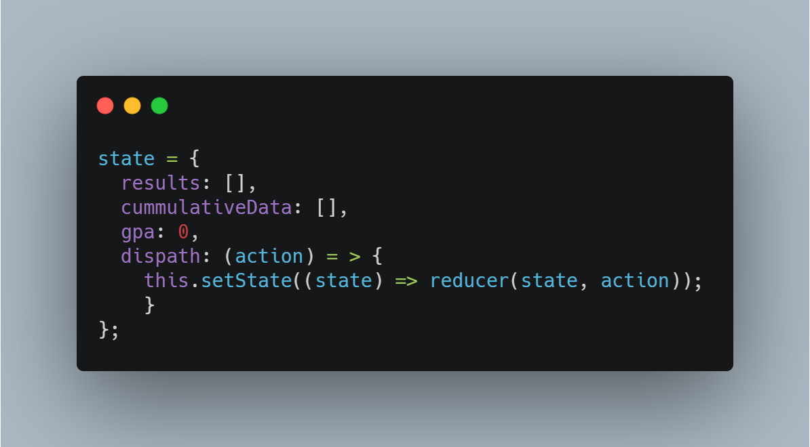
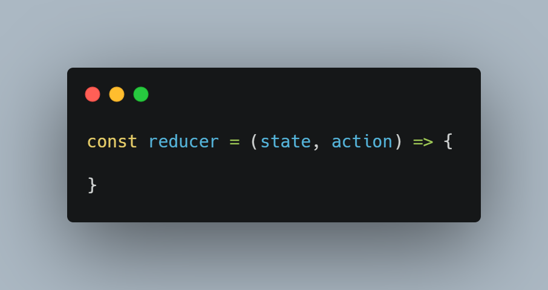
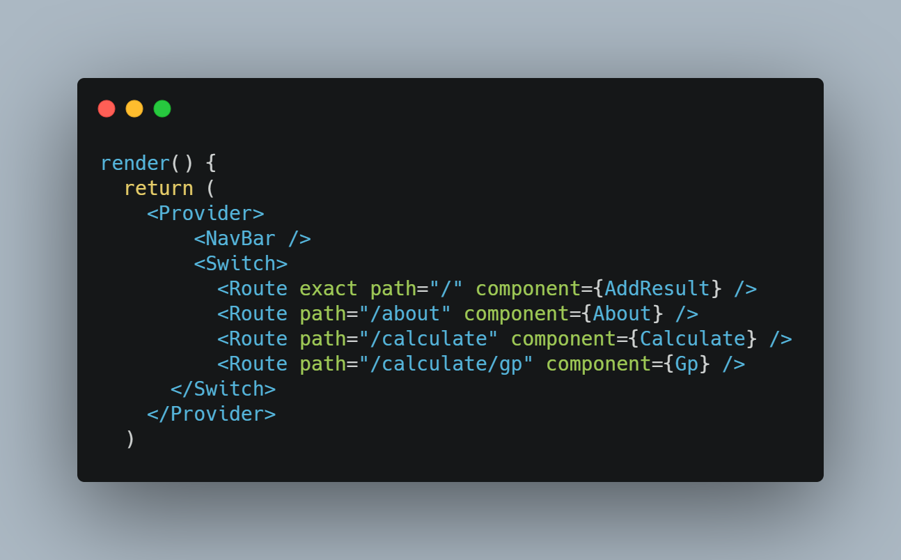

## Cummulative Grade Point Accumulator
GPA is a Grade Point Avarage Calculator written using ReactJs, a JavaScript library. 

Having a good GPA is important, that is why I have created this app to help student know where they stand and how to plan their college goals in respect to their grades.

## Description
This is project was done using ReactJs, a JavaScript library which is also called a framework these days. After deep thoughts and carrying out of surveys, asking fellow student what they would prefer, the one with more response was a GPA calculator. This calculator was done with a state management, ***Context State Management***, ***React-router*, **bootstrap** and **uuid** for generating id.  

Your average GPA is a number that shows what you typically scored in your classes throughout the semester, term, and year. Your GPA scores can go up and down throughout your time at the university and will change according to how much you improve your overall grades (or, in some cases, how much you fell behind).

Using a grade point system of 5, The calculator will give the GPA of each semester, as long as user keeps adding more courses. After calculating for a semester, another can be calculated for a new semester by clicking the ***add new semster*** button. The GPA calculator needs 3 parameters, The course title, the course grade and the course credit. On click of the **Calculate** button, the user is taken to another page that gives the option of deleting of the course detail entered, adding of more courses, and calculating the GPA of the course.  
Clicking of the ADD new semester, automatically wipes the previous courses recorded and a new form is displayed to add course information to be calculated.

### Methods

#### Wireframe
A wireframe is a way to design a website service at the structural level. A wireframe is commonly used to lay out content and functionality on a page which takes into account user needs and user journeys. Wireframes are used early in the development process to establish the basic structure of a page before visual design and content is added.  
The wireframe was the second stage for this app before going into writing code. For the wireframing of this project, it was done on [draw.io](https://app.diagrams.net/)

  

#### React
React is a popular used frontend JavaScript library which is also called a framework was launched in 2013. It makes it easy defining what a UI should look like. The JSX helps in writing HTML in JavaScript. React boosts productivity and facilitates maintenance. It ensures faster rendering wwhen building a heavy load application with the virtual DOM. Whe usin gReact Js one can be sure to have stable code as changes made in child component doesn't affect the parent component.  
React JS also helps in the breakdown of components, for large application, using a single file isn't an issue anymore. Just creatae multiple files and import into one main file, In situations when using HTML and CSS and JS, where the navbar has to be rewritten in all the HTML files created, just a single NavBAr.js file would be used in React and it displays on all pages. There are more reasons to use React.

#### Component 
A component is one isolated piece of interface. They are the building blocks of any React app and a typical React app will have many of these. In the case of this project we have 5 components. there different types of component, the **Functional(Stateless) Components** and the **Class(stateful) Components**
##### Functional Components
These components are purely presentational and are simply represented by a function that optionally takes props and returns a React element to be rendered to the page.
##### Class Components
These components are created using ES6’s class syntax. They have some additional features such as the ability to contain logic (for example methods that handle onClick events), local stateand other capabilities.

#### React Router 
React Router is a collection of navigational components that compose declaratively with an application. This app was to be made as a SinglePae App and React-router renders certain components to display depending on the route  beng used. To use react router and insallation needs to be done using "yarn add react-router-dom" or "npm install react-router-dom".  
The Link, BrowserRouter, Route and Switch was used in this project to achieve the Single Page Application. 

#### Bootstrap 
For a responsive and application, bootsrap was implemented, from the header to the table and card. Bootstrap is a framewor that help design websites faster and easier. It includes HTML andCSS based trmplates and also Javascript. With additonal CSS styling i created other parts of the project that I didnt make use of bootstrap. To ise bootstrap, it can either be installed or use of the cdn or download of the offline files.

#### State Management
State in React components is essential to manage and communicate data in your application. It is represented as a JavaScript object and has component level scope, it can be thought of as the private data of your component.
It can be considered the values that your application maintains.  
Every React component, both class and functional ones can have a state. For all intents and purposes, It’s the component’s memory. In a typical React app, when a user performs an action and changes a component’s state, it can have an impact on the state of any number of other components. This isn’t so bad when the app is simple. However, the more complex it gets, the more difficult it becomes to keep track of all the dependencies. We can use either **Redux** or **Context** state management. In this app, I used Context state manangement.

#### Context State Management
Context provides a way to pass data through the component tree without having to pass props. It is designed to share data all round the react compnent.    
In the Context.js file, the createContext creates an object. When React renders a component that subscribes to this Context object it will read the current context value from the closest matching Provider above it in the tree.  
Using the Context.Provider it accepts a value prop that is then passed to components that are descendants of the Provider. The object containes state and dispatch function so that it can be used by any other ccompponent.  

  
The useReducer(reducer) takes two parameters, state and action and returns a new state based on an action. 

In the App.js we import the Provider and wrap it around the components. In each component js file the Consumer is wrapped as the parent div.

#### UUID
This was used to generate random unique identifier for each inputed course. This helps the deleting and calculating aspecting of the project. to delete a data, the data has to be identifiied by a unique id. This is what the UUID does. The UUID is fast, uniform, secure, unpredictable and can also  be URL-friendly.

#### errors
In case of empty fields or inputing the wrong data, an error alert shows so the error can be fixed. For instance, leaving the course field will return an error when a user clicks on the calculate button. Also when the grade inputed is not A, B, C, D or F it gives an error.

## Installation
To install this project, 

#### `npm install`

or 

#### `yarn install`

then 

#### `npm start`

or

#### `yarn start`

This runs the app on http://localhost:3000

## Usage
This project has been made very simple for student to use. A 3 page application that solves problem in 2 pages. 
Any user that would like to use this app will need a course title, final semester grade and the credit unit for the course. On the home page there is a form to input the 3(course title, course grade, credit unit), after which you are to click on calculate. In siuations where there is error, like not inputing the right grade which is between the range of ( A- F, excluding E), there would be a prompt to make corrections as the app wont be able to calculate. When the right data is filled, next page displays all the course details inputed on a table, and one has the option to calculate or add more courses. All the courses done in a semester can be calclauted just keep adding more course till the courses have all been filled and then click calculate. The result is displayed beloy the table. 
To calculate for a new semester the user has to click on Add new smester button. On refreshing the page all data is lost and all the course will have to be re-inputted if not done calculating.

### Reference

[Uses of Boostrap](https://www.htmlgoodies.com/html5/markup/10-common-uses-of-bootstrap.html#:~:text=Bootstrap%20is%20a%20framework%20to,modals%2C%20image%20carousels%2C%20etc.&text=Here%20are%20some%20additional%20reasons,to%20phones%2C%20tablets%2C%20and%20desktops)

[React-Router-Dom](https://www.freecodecamp.org/news/react-router-in-5-minutes/)

[Context state management](https://reactjs.org/docs/context.html)

[Usefulness of react](https://da-14.com/blog/its-high-time-reactjs-ten-reasons-give-it-try)

[UUID](https://medium.com/javascript-in-plain-english/you-might-not-need-uuid-v4-for-generating-random-identifiers-89e8a28a7d77)

[JSX](https://reactjs.org/docs/introducing-jsx.html)

[Wireframe](https://www.experienceux.co.uk/faqs/what-is-wireframing/)

[Components](https://medium.com/the-andela-way/understanding-react-components-37f841c1f3bb#:~:text=Components%20are%20the%20building%20blocks,(User%20Interface)%20should%20appear.)